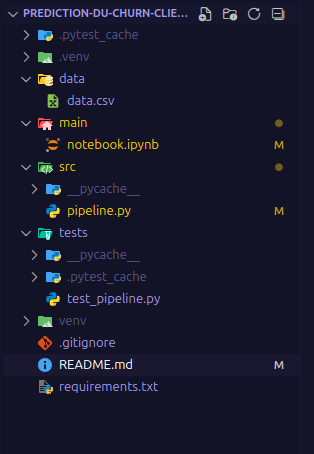
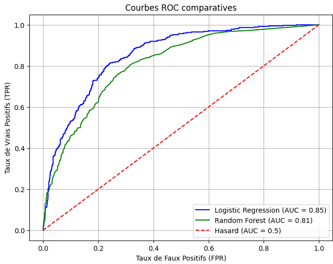

# Prédiction du Churn Client

---

## Objectif

Ce projet a pour but de développer un **pipeline de Machine Learning** pour prédire le **churn client** dans une entreprise de télécommunications.

Les objectifs principaux sont :

- Identifier les clients à risque de désabonnement.  
- Préparer et analyser les données (EDA) pour mieux comprendre les facteurs influençant le churn.  
- Entraîner et comparer plusieurs modèles supervisés : Logistic Regression et Random Forest.  
- Évaluer les modèles avec des métriques clés : Accuracy, Recall, F1-score, ROC-AUC.  

---

## Gestion du projet

Pour suivre une **approche professionnelle** de gestion de projet :

- J’ai organisé mes tâches en utilisant **Jira**.  
- J’ai créé plusieurs **branches sur GitHub** pour sauvegarder mes changements, notamment pour les **notebooks d’EDA** et les **tests unitaires avec Pytest**.  
- La structure des fichiers a été pensée pour rester **claire et modulaire**.  

  

---

## Technologies utilisées

- [Python](https://www.python.org/)  
- [Pandas](https://pandas.pydata.org/)  
- [NumPy](https://numpy.org/)  
- [Matplotlib](https://matplotlib.org/) et [Seaborn](https://seaborn.pydata.org/) pour la visualisation  
- [Scikit-learn](https://scikit-learn.org/stable/) pour le Machine Learning  
- [Pytest](https://docs.pytest.org/) pour les tests unitaires  

---

## Requirements

Pour exécuter le projet, installez les bibliothèques nécessaires :

- [x] `pandas`  
- [x] `numpy`  
- [x] `matplotlib`  
- [x] `seaborn`  
- [x] `scikit-learn`  
- [x] `pytest`
- [x] `imbalanced-learn`

### Installer toutes les dépendances en une seule commande :

- [x] `pip install -r requirements.txt`

---

## Installation et exécution

1. Cloner le dépôt :  
   - [x] `git clone https://github.com/manalfarouq/Prediction-du-Churn-Client-desabonnement-.git`  

2. Installer les dépendances :  
   - [x] `pip install -r requirements.txt`

3. Lancer le projet :  
   - Notebooks pour l’EDA : `main/notebooks.ipynb`  
   - Pipeline Machine Learning : `src/pipeline.py`

4. Exécuter les tests unitaires :  
   - [x] `pytest tests/ -v`

---

## Visualisations

- ROC Curve  
- Distribution du churn

    

## Choix du modèle

Le choix du modèle final s’est basé sur la comparaison des **courbes ROC** et des valeurs d’**AUC (Area Under the Curve)** présentées ci-dessus.

| Modèle                 | AUC  |
|------------------------|------|
| Logistic Regression    | 0.85 |
| Random Forest          | 0.81 |

La **Régression Logistique** a été retenue comme **modèle final** pour plusieurs raisons :

- >**Meilleure performance globale :** Son AUC (0.85) est supérieur à celui du Random Forest (0.81), indiquant une meilleure capacité à distinguer les clients susceptibles de se désabonner.  
- > **Interprétabilité :** La Régression Logistique permet une compréhension plus claire de l’influence de chaque variable sur le churn (poids des coefficients), ce qui facilite l’analyse métier.  
- > **Efficacité computationnelle :** Elle est plus rapide à entraîner et à exécuter, particulièrement adaptée à des jeux de données de taille moyenne.  

En revanche, le **Random Forest**, bien qu’efficace sur des ensembles complexes, a présenté une **légère perte de performance** (AUC = 0.81) et une **plus grande complexité** d’interprétation.  
Il reste néanmoins utile pour des comparaisons ou des validations croisées dans un cadre d’ensemble (ensemble learning).

Ainsi, le modèle **Logistic Regression** a été retenu pour la phase finale de déploiement et d’interprétation.

